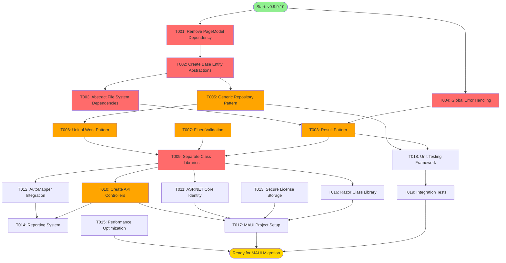

# 📋 Rosheta Project Task Manifest

**Project:** Rosheta - Prescription Management System  
**Version:** 0.9.9.10 → 1.0.0 (Target)  
**Document Created:** November 11, 2025  
**Based on:** [ARCHITECTURE_ANALYSIS.md](ARCHITECTURE_ANALYSIS.md) & [ROADMAP.md](ROADMAP.md)

---

## 📊 Executive Summary

This document provides a comprehensive, structured breakdown of all tasks required to transform Rosheta from its current state (v0.9.9.10) into a production-ready, MAUI-capable application with enterprise-grade architecture.

### Task Statistics

| Category | Total | Critical | High | Medium | Low |
|----------|-------|----------|------|--------|-----|
| **Architecture** | 9 | 4 | 3 | 2 | 0 |
| **Feature** | 6 | 0 | 2 | 2 | 2 |
| **Security** | 3 | 1 | 2 | 0 | 0 |
| **Testing** | 3 | 0 | 1 | 1 | 1 |
| **DevOps** | 2 | 0 | 0 | 1 | 1 |
| **Documentation** | 2 | 0 | 0 | 1 | 1 |
| **TOTAL** | **25** | **5** | **8** | **7** | **5** |

### Priority Breakdown

- 🔴 **CRITICAL**: 5 tasks (Pre-MAUI blockers, architectural violations)
- 🟡 **HIGH**: 8 tasks (Architectural quality, MAUI preparation)
- 🟢 **MEDIUM**: 7 tasks (Roadmap features, enhancements)
- 🔵 **LOW**: 5 tasks (Future features, optimizations)

### Complexity Distribution

| Complexity | Count | Average Effort |
|------------|-------|----------------|
| 1-3 (Low) | 6 tasks | 4-8 hours |
| 4-6 (Medium) | 10 tasks | 1-3 days |
| 7-9 (High) | 7 tasks | 4-7 days |
| 10 (Critical) | 2 tasks | 1-2 weeks |

### Estimated Timeline

**Total Effort:** ~14-16 weeks  
**Recommended Team Size:** 1-2 developers  
**Target Completion:** Q3 2025

---

## 🗺️ Dependency Graph



---

## 🎯 Recommended Execution Order

### **Phase 1: Foundation Fixes** (Weeks 1-2)
**Goal:** Fix critical architectural violations and create base abstractions

**Tasks:** T001, T002, T003, T004  
**Estimated Effort:** 2 weeks  
**Team Members:** 1 developer  
**Deliverables:** 
- ✅ Zero architectural violations
- ✅ Proper abstraction layers
- ✅ Testable codebase foundation

**Success Criteria:**
- All entity models inherit from base classes
- No direct file system access in services
- Global error handling middleware active
- All tests pass after refactoring

---

### **Phase 2: Architectural Patterns** (Weeks 3-5)
**Goal:** Implement enterprise patterns for better maintainability

**Tasks:** T005, T006, T007, T008, T012  
**Estimated Effort:** 3 weeks  
**Team Members:** 1-2 developers  
**Deliverables:**
- ✅ Reduced code duplication (60%+ reduction)
- ✅ Better error handling with Result pattern
- ✅ Comprehensive validation layer
- ✅ Improved testability score (5/10 → 8/10)

**Success Criteria:**
- Generic repository base implemented
- Unit of Work working for transactions
- FluentValidation integrated for all DTOs
- Services return Result<T> instead of throwing exceptions

---

### **Phase 3: MAUI Preparation** (Weeks 6-9)
**Goal:** Prepare codebase for MAUI Blazor Hybrid migration

**Tasks:** T009, T010, T011, T013, T016  
**Estimated Effort:** 4 weeks  
**Team Members:** 2 developers  
**Deliverables:**
- ✅ Shared class libraries (Core, Application, Infrastructure, Contracts)
- ✅ RESTful API for all entities
- ✅ Platform-agnostic business logic
- ✅ Authentication/authorization ready

**Success Criteria:**
- All business logic in separate class libraries
- API endpoints tested and documented
- Identity system integrated
- Zero platform-specific code in Core/Application layers

---

### **Phase 4: Features & Quality** (Weeks 10-12)
**Goal:** Implement remaining features and improve code quality

**Tasks:** T014, T015, T018, T019, T020, T021  
**Estimated Effort:** 3 weeks  
**Team Members:** 1-2 developers  
**Deliverables:**
- ✅ Reporting system operational
- ✅ Performance optimized
- ✅ Test coverage >70%
- ✅ Documentation complete

---

### **Phase 5: MAUI Migration** (Weeks 13-16)
**Goal:** Create and deploy MAUI Blazor Hybrid application

**Tasks:** T017, T022, T023, T024, T025  
**Estimated Effort:** 4 weeks  
**Team Members:** 2 developers  
**Deliverables:**
- ✅ Working MAUI desktop application
- ✅ Shared codebase between Web and Desktop
- ✅ Native installers for Windows
- ✅ Production deployment ready

---

## 📝 Detailed Task List

---

### 🔴 CRITICAL TASKS (Pre-MAUI Blockers)

---

### Task #001: Remove PageModel Dependency from DoctorRepository

**Priority:** Critical  
**Complexity:** 3/10  
**Status:** Pending  
**Estimated Effort:** 4-6 hours  
**Dependencies:** None  
**Category:** Architecture  
**Assigned To:** TBD  
**Target Phase:** Phase 1 (Week 1)

**Description:**
Remove the architectural violation where [`DoctorRepository.cs`](Repositories/DoctorRepository.cs:5) imports and uses `EditModel.DoctorProfileInputModel` from the Razor Pages layer. This creates a severe layering violation where the data access layer depends on the presentation layer.

**Current Issue:**
```csharp
// Line 5 in DoctorRepository.cs
using static Roshta.Pages.DoctorProfile.EditModel;

// Line 56 - Method signature violates separation of concerns
public async Task<bool> UpdateDoctorProfileAsync(int doctorId, DoctorProfileInputModel profileInput)
```

**Implementation Details:**

**Files to Modify:**
1. Create new DTO: `ViewModels/DoctorProfileUpdateDto.cs` (new file)
2. Modify: [`Repositories/Interfaces/IDoctorRepository.cs`](Repositories/Interfaces/IDoctorRepository.cs:1)
3. Modify: [`Repositories/DoctorRepository.cs`](Repositories/DoctorRepository.cs:1)
4. Modify: [`Services/Interfaces/IDoctorService.cs`](Services/Interfaces/IDoctorService.cs:1)
5. Modify: [`Services/DoctorService.cs`](Services/DoctorService.cs:1)
6. Modify: [`Pages/DoctorProfile/Edit.cshtml.cs`](Pages/DoctorProfile/Edit.cshtml.cs:1)

**Step-by-Step Implementation:**

1. **Create DTO** (`ViewModels/DoctorProfileUpdateDto.cs`):
```csharp
namespace Roshta.ViewModels;

public class DoctorProfileUpdateDto
{
    public string Name { get; set; } = string.Empty;
    public string Specialization { get; set; } = string.Empty;
    public string LicenseNumber { get; set; } = string.Empty;
    public string ContactPhone { get; set; } = string.Empty;
    public string ContactEmail { get; set; } = string.Empty;
}
```

2. **Update Interface** (IDoctorRepository.cs):
```csharp
Task<bool> UpdateDoctorProfileAsync(int doctorId, DoctorProfileUpdateDto profileDto);
```

3. **Update Repository** (DoctorRepository.cs):
   - Remove line 5: `using static Roshta.Pages.DoctorProfile.EditModel;`
   - Add: `using Roshta.ViewModels;`
   - Update method signature on line 56
   - Update parameter usage in method body (lines 66-70)

4. **Update Service Layer** to use new DTO

5. **Update PageModel** to map from InputModel to DTO before calling service

**Acceptance Criteria:**
- [ ] DoctorRepository has no references to any PageModel types
- [ ] All tests pass after refactoring
- [ ] Edit doctor profile functionality works identically
- [ ] No warnings or errors in build output
- [ ] Code review approved

**Test Strategy:**
1. Unit test repository method with new DTO
2. Integration test the full edit flow
3. Manual testing: Edit doctor profile and verify changes saved
4. Verify no regression in Setup flow

**Breaking Changes:**
- Service layer method signatures change
- PageModels must map to DTO before calling service

**Rollback Strategy:**
- Git revert if issues found
- Keep old DTO in separate namespace temporarily for backwards compatibility

---

### Task #002: Create Base Entity Abstractions

**Priority:** Critical  
**Complexity:** 5/10  
**Status:** Pending  
**Estimated Effort:** 8-12 hours  
**Dependencies:** None  
**Category:** Architecture  
**Target Phase:** Phase 1 (Week 1)

**Description:**
Create base entity classes and interfaces to eliminate code duplication across all domain models and enable interface-based audit logic in DbContext. Currently, all entities duplicate `Id`, `CreatedAt`, and `UpdatedAt` properties, and the [`ApplicationDbContext.OnBeforeSaving()`](Data/ApplicationDbContext.cs:103) method uses hard-coded type checking.

**Current Issue:**
```csharp
// ApplicationDbContext.cs lines 113-114
if (entry.Entity is Patient || entry.Entity is Doctor || entry.Entity is Medication || 
    entry.Entity is Prescription || entry.Entity is PrescriptionItem)
{
    // This violates Open/Closed Principle
}
```

**Implementation Details:**

**Files to Create:**
1. `Models/Base/IEntity.cs` (new)
2. `Models/Base/BaseEntity.cs` (new)
3. `Models/Base/IAuditable.cs` (new)
4. `Models/Base/AuditableEntity.cs` (new)

**Files to Modify:**
5. [`Models/Patient.cs`](Models/Patient.cs:1)
6. [`Models/Doctor.cs`](Models/Doctor.cs:1)
7. [`Models/Medication.cs`](Models/Medication.cs:1)
8. [`Models/Prescription.cs`](Models/Prescription.cs:1)
9. [`Models/PrescriptionItem.cs`](Models/PrescriptionItem.cs:1)
10. [`Data/ApplicationDbContext.cs`](Data/ApplicationDbContext.cs:103)

**Step-by-Step Implementation:**

1. **Create Base Interfaces and Classes:**

```csharp
// Models/Base/IEntity.cs
namespace Roshta.Models.Base;

public interface IEntity
{
    int Id { get; set; }
}

// Models/Base/BaseEntity.cs
namespace Roshta.Models.Base;

public abstract class BaseEntity : IEntity
{
    public int Id { get; set; }
}

// Models/Base/IAuditable.cs
namespace Roshta.Models.Base;

public interface IAuditable
{
    DateTime CreatedAt { get; set; }
    DateTime UpdatedAt { get; set; }
}

// Models/Base/AuditableEntity.cs
namespace Roshta.Models.Base;

public abstract class AuditableEntity : BaseEntity, IAuditable
{
    public DateTime CreatedAt { get; set; } = DateTime.UtcNow;
    public DateTime UpdatedAt { get; set; } = DateTime.UtcNow;
}
```

2. **Update All Entity Models:**

Example for Patient.cs:
```csharp
// Remove these lines:
// public int Id { get; set; }
// public DateTime CreatedAt { get; set; } = DateTime.UtcNow;
// public DateTime UpdatedAt { get; set; } = DateTime.UtcNow;

// Add inheritance:
public class Patient : AuditableEntity, IValidatableObject
```

Repeat for: Doctor, Medication, Prescription, PrescriptionItem

3. **Refactor DbContext Audit Logic:**

Replace lines 103-141 in ApplicationDbContext.cs:
```csharp
private void OnBeforeSaving()
{
    var entries = ChangeTracker.Entries<IAuditable>()
        .Where(e => e.State == EntityState.Added || e.State == EntityState.Modified);
    
    var utcNow = DateTime.UtcNow;
    
    foreach (var entry in entries)
    {
        entry.Entity.UpdatedAt = utcNow;
        
        if (entry.State == EntityState.Added)
        {
            entry.Entity.CreatedAt = utcNow;
        }
    }
}
```

4. **Create Database Migration:**
```bash
dotnet ef migrations add RefactorBaseEntities
```

**NuGet Packages:**
None required (uses existing EF Core)

**Acceptance Criteria:**
- [ ] All models inherit from AuditableEntity
- [ ] No duplicate Id, CreatedAt, UpdatedAt properties
- [ ] DbContext uses IAuditable interface for audit logic
- [ ] All existing functionality works unchanged
- [ ] Migration successfully applied to database
- [ ] All tests pass
- [ ] No breaking changes to API

**Test Strategy:**
1. Unit tests: Verify audit fields set correctly on Add/Update
2. Integration tests: Create and update each entity type
3. Database test: Verify migration runs cleanly
4. Manual testing: CRUD operations on all entities

**Breaking Changes:**
- None (property names and types remain identical)
- Migration required for existing databases

**Rollback Strategy:**
- Database migration can be reverted: `dotnet ef database update PreviousMigration`
- Code changes are backward compatible

---

### Task #003: Abstract File System Dependencies

**Priority:** Critical  
**Complexity:** 6/10  
**Status:** Pending  
**Estimated Effort:** 1 day  
**Dependencies:** T002 (recommended, not required)  
**Category:** Architecture  
**Target Phase:** Phase 1 (Week 1)

**Description:**
Create abstraction for file system access to enable platform-agnostic storage and improve testability. Currently, [`LicenseService`](Services/LicenseService.cs:1) and [`SettingsService`](Services/SettingsService.cs:1) directly use `System.IO.File`, which won't work correctly in MAUI across different platforms.

**Current Issues:**
```csharp
// LicenseService.cs lines 11-12, 39
private readonly string _activationFlagPath;
return File.Exists(_activationFlagPath); // Direct file system access
File.Create(_activationFlagPath).Dispose();
File.WriteAllText(_doctorIdFlagPath, doctorId.ToString());
File.ReadAllText(_doctorIdFlagPath);
```

**Implementation Details:**

**Files to Create:**
1. `Infrastructure/Storage/IFileStorageProvider.cs` (new)
2. `Infrastructure/Storage/LocalFileStorageProvider.cs` (new)
3. `Infrastructure/Storage/SecureStorageProvider.cs` (new - for MAUI future)

**Files to Modify:**
4. [`Services/LicenseService.cs`](Services/LicenseService.cs:1)
5. [`Services/SettingsService.cs`](Services/SettingsService.cs:1)
6. [`Program.cs`](Program.cs:1) - DI registration

**Step-by-Step Implementation:**

1. **Create Storage Abstraction:**

```csharp
// Infrastructure/Storage/IFileStorageProvider.cs
namespace Roshta.Infrastructure.Storage;

public interface IFileStorageProvider
{
    Task<bool> ExistsAsync(string path);
    Task<string> ReadAllTextAsync(string path);
    Task WriteAllTextAsync(string path, string content);
    Task CreateAsync(string path);
    Task DeleteAsync(string path);
    string GetBasePath();
}

// Infrastructure/Storage/LocalFileStorageProvider.cs
namespace Roshta.Infrastructure.Storage;

public class LocalFileStorageProvider : IFileStorageProvider
{
    private readonly string _basePath;

    public LocalFileStorageProvider()
    {
        _basePath = AppContext.BaseDirectory;
    }

    public async Task<bool> ExistsAsync(string path)
    {
        var fullPath = Path.Combine(_basePath, path);
        return await Task.FromResult(File.Exists(fullPath));
    }

    public async Task<string> ReadAllTextAsync(string path)
    {
        var fullPath = Path.Combine(_basePath, path);
        return await File.ReadAllTextAsync(fullPath);
    }

    public async Task WriteAllTextAsync(string path, string content)
    {
        var fullPath = Path.Combine(_basePath, path);
        await File.WriteAllTextAsync(fullPath, content);
    }

    public async Task CreateAsync(string path)
    {
        var fullPath = Path.Combine(_basePath, path);
        await using var stream = File.Create(fullPath);
        // File created
    }

    public async Task DeleteAsync(string path)
    {
        var fullPath = Path.Combine(_basePath, path);
        await Task.Run(() => File.Delete(fullPath));
    }

    public string GetBasePath() => _basePath;
}
```

2. **Update LicenseService:**

```csharp
// Constructor injection
private readonly IFileStorageProvider _storage;

public LicenseService(
    IOptions<LicenseSettings> licenseSettingsOptions,
    IFileStorageProvider storage)
{
    _licenseSettings = licenseSettingsOptions.Value;
    _storage = storage;
}

// Update all methods
public async Task<bool> IsActivatedAsync()
{
    return await _storage.ExistsAsync(".activated");
}

public async Task MarkAsActivatedAsync()
{
    await _storage.CreateAsync(".activated");
}
```

3. **Update SettingsService** similarly

4. **Register in DI Container** (Program.cs):
```csharp
// Add after line 14
builder.Services.AddSingleton<IFileStorageProvider, LocalFileStorageProvider>();
```

**NuGet Packages:**
None required

**Acceptance Criteria:**
- [ ] IFileStorageProvider interface created
- [ ] LocalFileStorageProvider implementation working
- [ ] LicenseService using abstraction (all sync methods converted to async)
- [ ] SettingsService using abstraction
- [ ] All file operations work identically
- [ ] PageModels updated to use async methods
- [ ] Unit tests created for storage provider
- [ ] All integration tests pass

**Test Strategy:**
1. Unit tests: Mock IFileStorageProvider for service tests
2. Integration tests: Verify actual file operations
3. Manual testing: Activation and settings functionality
4. Test exception handling for file system errors

**Breaking Changes:**
- Service methods change from sync to async (IsActivated → IsActivatedAsync)
- PageModels calling these services must be updated

**Rollback Strategy:**
- Keep old sync methods as wrapper around async for temporary compatibility
- Gradual migration path available

**Notes:**
- Prepare for future MAUI SecureStorageProvider implementation
- Consider encryption for sensitive data in future task

---

### Task #004: Implement Global Error Handling

**Priority:** Critical  
**Complexity:** 4/10  
**Status:** Pending  
**Estimated Effort:** 6-8 hours  
**Dependencies:** None  
**Category:** Architecture  
**Target Phase:** Phase 1 (Week 1)

**Description:**
Implement global exception handling middleware and create custom exception types for better error management, logging, and user experience. Currently, error handling is inconsistent with try-catch blocks scattered throughout the code.

**Current State:**
- No centralized error logging
- Inconsistent error responses
- No custom exception types
- Basic error page with no context

**Implementation Details:**

**Files to Create:**
1. `Exceptions/DomainException.cs` (new - base for domain exceptions)
2. `Exceptions/NotFoundException.cs` (new)
3. `Exceptions/ValidationException.cs` (new)
4. `Exceptions/LicenseException.cs` (new)
5. `Middleware/GlobalExceptionMiddleware.cs` (new)
6. `Models/ErrorViewModel.cs` (enhance existing)

**Files to Modify:**
7. [`Program.cs`](Program.cs:1) - middleware registration
8. [`Pages/Error.cshtml`](Pages/Error.cshtml:1) - enhanced error display
9. [`Pages/Error.cshtml.cs`](Pages/Error.cshtml.cs:1) - enhanced model

**Step-by-Step Implementation:**

1. **Create Custom Exception Types:**

```csharp
// Exceptions/DomainException.cs
namespace Roshta.Exceptions;

public abstract class DomainException : Exception
{
    public string Code { get; }
    public int HttpStatusCode { get; protected set; }

    protected DomainException(string message, string code) 
        : base(message)
    {
        Code = code;
        HttpStatusCode = 400;
    }

    protected DomainException(string message, string code, Exception innerException) 
        : base(message, innerException)
    {
        Code = code;
        HttpStatusCode = 400;
    }
}

// Exceptions/NotFoundException.cs
namespace Roshta.Exceptions;

public class NotFoundException : DomainException
{
    public NotFoundException(string entityName, object id)
        : base($"{entityName} with ID '{id}' was not found.", "NOT_FOUND")
    {
        HttpStatusCode = 404;
    }
}

// Exceptions/ValidationException.cs
namespace Roshta.Exceptions;

public class ValidationException : DomainException
{
    public Dictionary<string, string[]> Errors { get; }

    public ValidationException(Dictionary<string, string[]> errors)
        : base("One or more validation errors occurred.", "VALIDATION_ERROR")
    {
        Errors = errors;
        HttpStatusCode = 400;
    }
}

// Exceptions/LicenseException.cs
namespace Roshta.Exceptions;

public class LicenseException : DomainException
{
    public LicenseException(string message)
        : base(message, "LICENSE_ERROR")
    {
        HttpStatusCode = 403;
    }
}
```

2. **Create Global Exception Middleware:**

```csharp
// Middleware/GlobalExceptionMiddleware.cs
using Microsoft.AspNetCore.Diagnostics;
using Roshta.Exceptions;
using System.Text.Json;

namespace Roshta.Middleware;

public class GlobalExceptionMiddleware
{
    private readonly RequestDelegate _next;
    private readonly ILogger<GlobalExceptionMiddleware> _logger;
    private readonly IWebHostEnvironment _environment;

    public GlobalExceptionMiddleware(
        RequestDelegate next,
        ILogger<GlobalExceptionMiddleware> logger,
        IWebHostEnvironment environment)
    {
        _next = next;
        _logger = logger;
        _environment = environment;
    }

    public async Task InvokeAsync(HttpContext context)
    {
        try
        {
            await _next(context);
        }
        catch (Exception ex)
        {
            await HandleExceptionAsync(context, ex);
        }
    }

    private async Task HandleExceptionAsync(HttpContext context, Exception exception)
    {
        var statusCode = 500;
        var message = "An internal server error occurred.";
        var code = "INTERNAL_ERROR";
        object? details = null;

        switch (exception)
        {
            case DomainException domainEx:
                statusCode = domainEx.HttpStatusCode;
                message = domainEx.Message;
                code = domainEx.Code;
                if (domainEx is ValidationException validationEx)
                {
                    details = validationEx.Errors;
                }
                _logger.LogWarning(domainEx, "Domain exception occurred: {Code}", code);
                break;

            default:
                _logger.LogError(exception, "Unhandled exception occurred");
                if (_environment.IsDevelopment())
                {
                    message = exception.Message;
                    details = new
                    {
                        exception.StackTrace,
                        InnerException = exception.InnerException?.Message
                    };
                }
                break;
        }

        context.Response.StatusCode = statusCode;

        // For API requests, return JSON
        if (context.Request.Path.StartsWithSegments("/api"))
        {
            context.Response.ContentType = "application/json";
            var response = new
            {
                error = new
                {
                    code,
                    message,
                    details
                }
            };
            await context.Response.WriteAsync(JsonSerializer.Serialize(response));
        }
        else
        {
            // For Razor Pages, redirect to error page with details
            context.Items["ErrorMessage"] = message;
            context.Items["ErrorCode"] = code;
            context.Items["ErrorDetails"] = details;
            context.Response.Redirect($"/Error?code={statusCode}");
        }
    }
}
```

3. **Register Middleware in Program.cs:**

```csharp
// Add after line 49, replace existing error handling
app.UseMiddleware<GlobalExceptionMiddleware>();

if (!app.Environment.IsDevelopment())
{
    app.UseExceptionHandler("/Error");
    app.UseHsts();
}
else
{
    app.UseDeveloperExceptionPage();
}
```

4. **Install Structured Logging (Optional but Recommended):**

NuGet packages to add:
```xml
<PackageReference Include="Serilog.AspNetCore" Version="8.0.0" />
<PackageReference Include="Serilog.Sinks.File" Version="5.0.0" />
<PackageReference Include="Serilog.Sinks.Console" Version="5.0.0" />
```

Configure in Program.cs before builder creation:
```csharp
using Serilog;

Log.Logger = new LoggerConfiguration()
    .WriteTo.Console()
    .WriteTo.File("logs/rosheta-.txt", rollingInterval: RollingInterval.Day)
    .CreateLogger();

builder.Host.UseSerilog();
```

**Acceptance Criteria:**
- [ ] All custom exception types created
- [ ] GlobalExceptionMiddleware implemented
- [ ] Middleware registered in pipeline
- [ ] Domain exceptions properly logged
- [ ] User-friendly error messages displayed
- [ ] Development vs Production error details differ
- [ ] API errors return JSON
- [ ] Razor Page errors redirect properly
- [ ] All tests updated to handle new exceptions

**Test Strategy:**
1. Unit tests: Test each exception type
2. Integration tests: Trigger exceptions and verify handling
3. Manual testing: 
   - Throw NotFoundException and verify 404 page
   - Throw ValidationException and verify error display
   - Simulate server error and verify logging
4. Test both API and Razor Page error paths

**Breaking Changes:**
- Services should now throw domain exceptions instead of generic exceptions
- Existing error handling code needs updating

**Rollback Strategy:**
- Remove middleware registration
- Revert to previous exception handling
- Keep custom exception types for future use

---

### 🟡 HIGH PRIORITY TASKS (Architectural Quality)

---

### Task #005: Implement Generic Repository Pattern

**Priority:** High  
**Complexity:** 8/10  
**Status:** Pending  
**Estimated Effort:** 3-4 days  
**Dependencies:** T002 (Base Entity Abstractions)  
**Category:** Architecture  
**Target Phase:** Phase 2 (Week 3)

**Description:**
Create generic repository base classes to eliminate code duplication across repositories and provide consistent CRUD operations. Currently, each repository duplicates common operations, pagination logic, and exception handling.

**Current Issues:**
- ~200 lines of duplicated code across 4 repositories
- Inconsistent query patterns
- No shared pagination/sorting logic
- Difficult to add cross-cutting concerns

**Implementation Details:**

**Files to Create:**
1. `Repositories/Interfaces/IRepository.cs` (new)
2. `Repositories/Interfaces/IReadRepository.cs` (new)
3. `Repositories/Base/RepositoryBase.cs` (new)
4. `Specifications/ISpecification.cs` (new - for complex queries)
5. `Specifications/BaseSpecification.cs` (new)

**Files to Modify:**
6. All existing repository interfaces to extend IRepository<T>
7. All existing repository implementations to inherit from RepositoryBase<T>
8. Update unit tests to work with generic base

**Step-by-Step Implementation:**

1. **Create Generic Interfaces:**

```csharp
// Repositories/Interfaces/IReadRepository.cs
using Roshta.Models.Base;

namespace Roshta.Repositories.Interfaces;

public interface IReadRepository<T> where T : BaseEntity
{
    Task<T?> GetByIdAsync(int id, CancellationToken cancellationToken = default);
    Task<IReadOnlyList<T>> GetAllAsync(CancellationToken cancellationToken = default);
    Task<IReadOnlyList<T>> GetAsync(
        ISpecification<T> spec, 
        CancellationToken cancellationToken = default);
    Task<int> CountAsync(
        ISpecification<T> spec, 
        CancellationToken cancellationToken = default);
    Task<bool> ExistsAsync(int id, CancellationToken cancellationToken = default);
}

// Repositories/Interfaces/IRepository.cs
namespace Roshta.Repositories.Interfaces;

public interface IRepository<T> : IReadRepository<T> where T : BaseEntity
{
    Task<T> AddAsync(T entity, CancellationToken cancellationToken = default);
    Task<IEnumerable<T>> AddRangeAsync(
        IEnumerable<T> entities, 
        CancellationToken cancellationToken = default);
    Task UpdateAsync(T entity, CancellationToken cancellationToken = default);
    Task DeleteAsync(T entity, CancellationToken cancellationToken = default);
    Task DeleteAsync(int id, CancellationToken cancellationToken = default);
}
```

2. **Create Specification Pattern:**

```csharp
// Specifications/ISpecification.cs
using System.Linq.Expressions;

namespace Roshta.Specifications;

public interface ISpecification<T>
{
    Expression<Func<T, bool>>? Criteria { get; }
    List<Expression<Func<T, object>>> Includes { get; }
    List<string> IncludeStrings { get; }
    Expression<Func<T, object>>? OrderBy { get; }
    Expression<Func<T, object>>? OrderByDescending { get; }
    int Take { get; }
    int Skip { get; }
    bool IsPagingEnabled { get; }
}

// Specifications/BaseSpecification.cs
using System.Linq.Expressions;

namespace Roshta.Specifications;

public abstract class BaseSpecification<T> : ISpecification<T>
{
    public Expression<Func<T, bool>>? Criteria { get; private set; }
    public List<Expression<Func<T, object>>> Includes { get; } = new();
    public List<string> IncludeStrings { get; } = new();
    public Expression<Func<T, object>>? OrderBy { get; private set; }
    public Expression<Func<T, object>>? OrderByDescending { get; private set; }
    public int Take { get; private set; }
    public int Skip { get; private set; }
    public bool IsPagingEnabled { get; private set; }

    protected BaseSpecification() { }

    protected BaseSpecification(Expression<Func<T, bool>> criteria)
    {
        Criteria = criteria;
    }

    protected virtual void AddInclude(Expression<Func<T, object>> includeExpression)
    {
        Includes.Add(includeExpression);
    }

    protected virtual void AddInclude(string includeString)
    {
        IncludeStrings.Add(includeString);
    }

    protected virtual void ApplyOrderBy(Expression<Func<T, object>> orderByExpression)
    {
        OrderBy = orderByExpression;
    }

    protected virtual void ApplyOrderByDescending(Expression<Func<T, object>> orderByDescExpression)
    {
        OrderByDescending = orderByDescExpression;
    }

    protected virtual void ApplyPaging(int skip, int take)
    {
        Skip = skip;
        Take = take;
        IsPagingEnabled = true;
    }
}
```

3. **Create Repository Base Class:**

```csharp
// Repositories/Base/RepositoryBase.cs
using Microsoft.EntityFrameworkCore;
using Roshta.Data;
using Roshta.Models.Base;
using Roshta.Repositories.Interfaces;
using Roshta.Specifications;

namespace Roshta.Repositories.Base;

public class RepositoryBase<T> : IRepository<T> where T : BaseEntity
{
    protected readonly ApplicationDbContext _context;
    protected readonly DbSet<T> _dbSet;

    public RepositoryBase(ApplicationDbContext context)
    {
        _context = context;
        _dbSet = context.Set<T>();
    }

    public virtual async Task<T?> GetByIdAsync(int id, CancellationToken cancellationToken = default)
    {
        return await _dbSet.FindAsync(new object[] { id }, cancellationToken);
    }

    public virtual async Task<IReadOnlyList<T>> GetAllAsync(CancellationToken cancellationToken = default)
    {
        return await _dbSet.ToListAsync(cancellationToken);
    }

    public virtual async Task<IReadOnlyList<T>> GetAsync(
        ISpecification<T> spec, 
        CancellationToken cancellationToken = default)
    {
        return await ApplySpecification(spec).ToListAsync(cancellationToken);
    }

    public virtual async Task<int> CountAsync(
        ISpecification<T> spec, 
        CancellationToken cancellationToken = default)
    {
        return await ApplySpecification(spec).CountAsync(cancellationToken);
    }

    public virtual async Task<bool> ExistsAsync(int id, CancellationToken cancellationToken = default)
    {
        return await _dbSet.AnyAsync(e => e.Id == id, cancellationToken);
    }

    public virtual async Task<T> AddAsync(T entity, CancellationToken cancellationToken = default)
    {
        await _dbSet.AddAsync(entity, cancellationToken);
        await _context.SaveChangesAsync(cancellationToken);
        return entity;
    }

    public virtual async Task<IEnumerable<T>> AddRangeAsync(
        IEnumerable<T> entities, 
        CancellationToken cancellationToken = default)
    {
        await _dbSet.AddRangeAsync(entities, cancellationToken);
        await _context.SaveChangesAsync(cancellationToken);
        return entities;
    }

    public virtual async Task UpdateAsync(T entity, CancellationToken cancellationToken = default)
    {
        _context.Entry(entity).State = EntityState.Modified;
        await _context.SaveChangesAsync(cancellationToken);
    }

    public virtual async Task DeleteAsync(T entity, CancellationToken cancellationToken = default)
    {
        _dbSet.Remove(entity);
        await _context.SaveChangesAsync(cancellationToken);
    }

    public virtual async Task DeleteAsync(int id, CancellationToken cancellationToken = default)
    {
        var entity = await GetByIdAsync(id, cancellationToken);
        if (entity != null)
        {
            await DeleteAsync(entity, cancellationToken);
        }
    }

    private IQueryable<T> ApplySpecification(ISpecification<T> spec)
    {
        return SpecificationEvaluator<T>.GetQuery(_dbSet.AsQueryable(), spec);
    }
}

// Specifications/SpecificationEvaluator.cs
using Microsoft.EntityFrameworkCore;
using Roshta.Models.Base;

namespace Roshta.Specifications;

public class SpecificationEvaluator<T> where T : BaseEntity
{
    public static IQueryable<T> GetQuery(IQueryable<T> inputQuery, ISpecification<T> spec)
    {
        var query = inputQuery;

        if (spec.Criteria != null)
        {
            query = query.Where(spec.Criteria);
        }

        query = spec.Includes.Aggregate(query, (current, include) => current.Include(include));
        query = spec.IncludeStrings.Aggregate(query, (current, include) => current.Include(include));

        if (spec.OrderBy != null)
        {
            query = query.OrderBy(spec.OrderBy);
        }
        else if (spec.OrderByDescending != null)
        {
            query = query.OrderByDescending(spec.OrderByDescending);
        }

        if (spec.IsPagingEnabled)
        {
            query = query.Skip(spec.Skip).Take(spec.Take);
        }

        return query;
    }
}
```

4. **Refactor Existing Repositories:**

Example for PatientRepository:
```csharp
// Update interface
public interface IPatientRepository : IRepository<Patient>
{
    // Keep only entity-specific methods
    Task<List<Patient>> SearchAsync(string searchTerm);
    // Remove: GetByIdAsync, GetAllAsync, etc. (now in base)
}

// Update implementation
public class PatientRepository : RepositoryBase<Patient>, IPatientRepository
{
    public PatientRepository(ApplicationDbContext context) : base(context) { }

    // Keep only custom methods
    public async Task<List<Patient>> SearchAsync(string searchTerm)
    {
        var spec = new PatientSearchSpecification(searchTerm);
        return (await GetAsync(spec)).ToList();
    }
}
```

5. **Create Example Specifications:**

```csharp
// Specifications/PatientSearchSpecification.cs
using Roshta.Models;

namespace Roshta.Specifications;

public class PatientSearchSpecification : BaseSpecification<Patient>
{
    public PatientSearchSpecification(string searchTerm) 
        : base(p => 
            p.Name.Contains(searchTerm) || 
            (p.ContactInfo != null && p.ContactInfo.Contains(searchTerm)))
    {
        ApplyOrderBy(p => p.Name);
    }
}

// Specifications/ActivePatientsSpecification.cs
public class ActivePatientsSpecification : BaseSpecification<Patient>
{
    public ActivePatientsSpecification() : base(p => p.IsActive)
    {
        ApplyOrderByDescending(p => p.LastVisitDate ?? DateTime.MinValue);
    }
}
```

**NuGet Packages:**
None required (uses existing EF Core)

**Acceptance Criteria:**
- [ ] Generic repository base classes created
- [ ] Specification pattern implemented
- [ ] All existing repositories refactored to use base
- [ ] Code duplication reduced by >60%
- [ ] All existing functionality works unchanged
- [ ] New specifications created for common queries
- [ ] Unit tests pass
- [ ] Integration tests pass
- [ ] Documentation updated

**Test Strategy:**
1. Unit tests: Test generic repository with in-memory database
2. Unit tests: Test specification pattern
3. Integration tests: Verify all CRUD operations
4. Performance tests: Compare query performance before/after
5. Manual testing: All list/search pages work correctly

**Breaking Changes:**
- Repository interfaces change (add inheritance)
- Some methods may have different signatures
- Services may need minor updates

**Rollback Strategy:**
- Keep old repository implementations in separate namespace temporarily
- Gradual migration repository by repository
- Feature flag for switching between old/new repositories

**Code Quality Impact:**
- Lines of code: -200 (code reduction)
- Maintainability: Significantly improved
- Testability: Improved with specification pattern
- Reusability: High

---

### Task #006: Implement Unit of Work Pattern

**Priority:** High  
**Complexity:** 6/10  
**Status:** Pending  
**Estimated Effort:** 2-3 days  
**Dependencies:** T005 (Generic Repository Pattern)  
**Category:** Architecture  
**Target Phase:** Phase 2 (Week 3-4)

**Description:**
Implement Unit of Work pattern to manage transactions across multiple repositories and ensure data consistency. Currently, services directly call SaveChanges on repositories, making it difficult to maintain transactional integrity across multiple operations.

**Current Issues:**
- No transaction management across multiple repository operations
- SaveChanges called in repositories (should be in Unit of Work)
- Difficult to rollback complex operations
- No support for nested transactions

**Implementation Details:**

**Files to Create:**
1. `Data/Interfaces/IUnitOfWork.cs` (new)
2. `Data/UnitOfWork.cs` (new)

**Files to Modify:**
3. Remove SaveChangesAsync from all repository methods
4. Update all services to use Unit of Work
5. [`Program.cs`](Program.cs:1) - register UnitOfWork

**Step-by-Step Implementation:**

1. **Create Unit of Work Interface:**

```csharp
// Data/Interfaces/IUnitOfWork.cs
using Roshta.Repositories.Interfaces;

namespace Roshta.Data.Interfaces;

public interface IUnitOfWork : IDisposable
{
    // Repository properties
    IPatientRepository Patients { get; }
    IDoctorRepository Doctors { get; }
    IMedicationRepository Medications { get; }
    IPrescriptionRepository Prescriptions { get; }
    
    // Transaction methods
    Task<int> SaveChangesAsync(CancellationToken cancellationToken = default);
    Task<int> SaveChangesAsync(bool acceptAllChangesOnSuccess, CancellationToken cancellationToken = default);
    
    // Transaction support
    Task BeginTransactionAsync(CancellationToken cancellationToken = default);
    Task CommitTransactionAsync(CancellationToken cancellationToken = default);
    Task RollbackTransactionAsync(CancellationToken cancellationToken = default);
    
    // Get repository by type (for generic access)
    IRepository<T> Repository<T>() where T : class;
}
```

2. **Implement Unit of Work:**

```csharp
// Data/UnitOfWork.cs
using Microsoft.EntityFrameworkCore;
using Microsoft.EntityFrameworkCore.Storage;
using Roshta.Data.Interfaces;
using Roshta.Models.Base;
using Roshta.Repositories;
using Roshta.Repositories.Base;
using Roshta.Repositories.Interfaces;

namespace Roshta.Data;

public class UnitOfWork : IUnitOfWork
{
    private readonly ApplicationDbContext _context;
    private IDbContextTransaction? _transaction;
    private readonly Dictionary<Type, object> _repositories;

    // Repository properties
    public IPatientRepository Patients { get; }
    public IDoctorRepository Doctors { get; }
    public IMedicationRepository Medications { get; }
    public IPrescriptionRepository Prescriptions { get; }

    public UnitOfWork(
        ApplicationDbContext context,
        IPatientRepository patientRepository,
        IDoctorRepository doctorRepository,
        IMedicationRepository medicationRepository,
        IPrescriptionRepository prescriptionRepository)
    {
        _context = context;
        _repositories = new Dictionary<Type, object>();

        // Initialize repositories
        Patients = patientRepository;
        Doctors = doctorRepository;
        Medications = medicationRepository;
        Prescriptions = prescriptionRepository;
    }

    public async Task<int> SaveChangesAsync(CancellationToken cancellationToken = default)
    {
        return await _context.SaveChangesAsync(cancellationToken);
    }

    public async Task<int> SaveChangesAsync(bool acceptAllChangesOnSuccess, CancellationToken cancellationToken = default)
    {
        return await _context.SaveChangesAsync(acceptAllChangesOnSuccess, cancellationToken);
    }

    public async Task BeginTransactionAsync(CancellationToken cancellationToken = default)
    {
        _transaction = await _context.Database.BeginTransactionAsync(cancellationToken);
    }

    public async Task CommitTransactionAsync(CancellationToken cancellationToken = default)
    {
        try
        {
            await SaveChangesAsync(cancellationToken);
            
            if (_transaction != null)
            {
                await _transaction.CommitAsync(cancellationToken);
            }
        }
        catch
        {
            await RollbackTransactionAsync(cancellationToken);
            throw;
        }
        finally
        {
            if (_transaction != null)
            {
                await _transaction.DisposeAsync();
                _transaction = null;
            }
        }
    }

    public async Task RollbackTransactionAsync(CancellationToken cancellationToken = default)
    {
        if (_transaction != null)
        {
            await _transaction.RollbackAsync(cancellationToken);
            await _transaction.DisposeAsync();
            _transaction = null;
        }
    }

    public IRepository<T> Repository<T>() where T : class
    {
        var type = typeof(T);
        
        if (!_repositories.ContainsKey(type))
        {
            var repositoryType = typeof(RepositoryBase<>).MakeGenericType(typeof(T));
            _repositories[type] = Activator.CreateInstance(repositoryType, _context)!;
        }

        return (IRepository<T>)_repositories[type];
    }

    public void Dispose()
    {
        _transaction?.Dispose();
        _context.Dispose();
    }
}
```

3. **Update Repository Base (Remove SaveChanges):**

```csharp
// In RepositoryBase<T>, remove all SaveChangesAsync calls:
public virtual async Task<T> AddAsync(T entity, CancellationToken cancellationToken = default)
{
    await _dbSet.AddAsync(entity, cancellationToken);
    // REMOVED: await _context.SaveChangesAsync(cancellationToken);
    return entity;
}
// Repeat for all methods
```

4. **Update Services to Use Unit of Work:**

```csharp
// Example: PrescriptionService
public class PrescriptionService : IPrescriptionService
{
    private readonly IUnitOfWork _unitOfWork;

    public PrescriptionService(IUnitOfWork unitOfWork)
    {
        _unitOfWork = unitOfWork;
    }

    public async Task<Result<Prescription>> CreatePrescriptionAsync(PrescriptionCreateModel model)
    {
        try
        {
            await _unitOfWork.BeginTransactionAsync();

            var prescription = new Prescription
            {
                PatientId = model.PatientId,
                DoctorId = model.DoctorId,
                // ... other properties
            };

            await _unitOfWork.Prescriptions.AddAsync(prescription);

            // Add prescription items
            foreach (var item in model.Items)
            {
                var prescriptionItem = new PrescriptionItem
                {
                    PrescriptionId = prescription.Id,
                    MedicationId = item.MedicationId,
                    // ... other properties
                };
                await _unitOfWork.Repository<PrescriptionItem>().AddAsync(prescriptionItem);
            }

            await _unitOfWork.CommitTransactionAsync();
            return Result<Prescription>.Success(prescription);
        }
        catch (Exception ex)
        {
            await _unitOfWork.RollbackTransactionAsync();
            return Result<Prescription>.Failure($"Failed to create prescription: {ex.Message}");
        }
    }
}
```

5. **Register in DI Container:**

```csharp
// Program.cs - replace individual repository registrations
builder.Services.AddScoped<IUnitOfWork, UnitOfWork>();

// Keep individual repository registrations for injection into UnitOfWork
builder.Services.AddScoped<IPatientRepository, PatientRepository>();
builder.Services.AddScoped<IDoctorRepository, DoctorRepository>();
builder.Services.AddScoped<IMedicationRepository, MedicationRepository>();
builder.Services.AddScoped<IPrescriptionRepository, PrescriptionRepository>();
```

**NuGet Packages:**
None required (uses existing EF Core)

**Acceptance Criteria:**
- [ ] IUnitOfWork interface created
- [ ] UnitOfWork implementation complete
- [ ] SaveChanges removed from all repositories
- [ ] All services updated to use Unit of Work
- [ ] Transaction support working
- [ ] Rollback functionality tested
- [ ] All integration tests pass
- [ ] No data integrity issues

**Test Strategy:**
1. Unit tests: Mock Unit of Work in service tests
2. Integration tests: Test transaction commit/rollback
3. Test scenario: Create prescription with items, force error, verify rollback
4. Test scenario: Multiple concurrent operations
5. Performance tests: Compare transaction overhead

**Breaking Changes:**
- Services now require IUnitOfWork instead of individual repositories
- Repository methods no longer save changes automatically

**Rollback Strategy:**
- Keep SaveChanges in repositories temporarily with feature flag
- Gradual service migration
- Can operate in hybrid mode during transition

---

### Task #007: Integrate FluentValidation

**Priority:** High  
**Complexity:** 7/10  
**Status:** Pending  
**Estimated Effort:** 3-4 days  
**Dependencies:** T002 (Base Entities), T009 (Class Libraries - recommended)  
**Category:** Architecture  
**Target Phase:** Phase 2 (Week 4)

**Description:**
Implement FluentValidation for comprehensive, reusable, and testable validation logic. Currently, validation is scattered across Data Annotations, IValidatableObject implementations, and manual checks in services.

**Current Issues:**
- Validation logic duplicated between models and ViewModels
- Complex validation rules difficult to express with Data Annotations
- Hard to unit test validation logic
- No validation pipeline for DTOs

**Implementation Details:**

**Files to Create:**
1. `Validators/PatientValidator.cs` (new)
2. `Validators/DoctorValidator.cs` (new)
3. `Validators/MedicationValidator.cs` (new)
4. `Validators/PrescriptionValidator.cs` (new)
5. `Validators/PrescriptionCreateModelValidator.cs` (new)
6. `Validators/DoctorProfileUpdateDtoValidator.cs` (new)

**Files to Modify:**
7. [`Program.cs`](Program.cs:1) - FluentValidation registration
8. Remove IValidatableObject from [`Patient.cs`](Models/Patient.cs:7)
9. Update PageModels to use FluentValidation results
10. Update services to validate before operations

**Step-by-Step Implementation:**

1. **Install NuGet Packages:**

```xml
<PackageReference Include="FluentValidation" Version="11.9.0" />
<PackageReference Include="FluentValidation.DependencyInjectionExtensions" Version="11.9.0" />
<PackageReference Include="FluentValidation.AspNetCore" Version="11.3.0" />
```

2. **Create Validators:**

```csharp
// Validators/PatientValidator.cs
using FluentValidation;
using Roshta.Models;

namespace Roshta.Validators;

public class PatientValidator : AbstractValidator<Patient>
{
    public PatientValidator()
    {
        RuleFor(p => p.Name)
            .NotEmpty().WithMessage("Patient name is required.")
            .MaximumLength(100).WithMessage("Name cannot exceed 100 characters.");

        RuleFor(p => p.DateOfBirth)
            .LessThan(DateTime.Today).WithMessage("Date of Birth must be in the past.")
            .GreaterThan(new DateTime(1900, 1, 1)).WithMessage("Date of Birth must be after 1900.");

        RuleFor(p => p.ContactInfo)
            .MaximumLength(200).WithMessage("Contact info cannot exceed 200 characters.")
            .Must(BeValidContactInfo).WithMessage("Contact info must be a valid phone or email.");

        RuleFor(p => p.LastVisitDate)
            .LessThanOrEqualTo(DateTime.Today)
            .When(p => p.LastVisitDate.HasValue)
            .WithMessage("Last Visit Date cannot be in the future.");

        RuleFor(p => p.VisitCount)
            .GreaterThanOrEqualTo(0).WithMessage("Visit count cannot be negative.");
    }

    private bool BeValidContactInfo(string? contactInfo)
    {
        if (string.IsNullOrWhiteSpace(contactInfo))
            return true; // Optional field

        // Simple validation: either email format or Egyptian phone number
        var emailRegex = @"^[^@\s]+@[^@\s]+\.[^@\s]+$";
        var phoneRegex = @"^01[0-2,5]\d{8}$";

        return System.Text.RegularExpressions.Regex.IsMatch(contactInfo, emailRegex) ||
               System.Text.RegularExpressions.Regex.IsMatch(contactInfo, phoneRegex);
    }
}

// Validators/PrescriptionCreateModelValidator.cs
using FluentValidation;
using Roshta.ViewModels;

namespace Roshta.Validators;

public class PrescriptionCreateModelValidator : AbstractValidator<PrescriptionCreateModel>
{
    public PrescriptionCreateModelValidator()
    {
        RuleFor(p => p.PatientId)
            .GreaterThan(0).WithMessage("Please select a patient.");

        RuleFor(p => p.DoctorId)
            .GreaterThan(0).WithMessage("Doctor ID is required.");

        RuleFor(p => p.PrescriptionItems)
            .NotEmpty().WithMessage("At least one medication must be added to the prescription.")
            .Must(items => items.Count <= 20).WithMessage("Cannot add more than 20 medications.");

        RuleForEach(p => p.PrescriptionItems).ChildRules(item =>
        {
            item.RuleFor(i => i.MedicationId)
                .GreaterThan(0).WithMessage("Please select a medication.");

            item.RuleFor(i => i.Dosage)
                .NotEmpty().WithMessage("Dosage is required.")
                .MaximumLength(100);

            item.RuleFor(i => i.Frequency)
                .NotEmpty().WithMessage("Frequency is required.")
                .MaximumLength(100);

            item.RuleFor(i => i.Duration)
                .NotEmpty().WithMessage("Duration is required.")
                .MaximumLength(100);
        });
    }
}

// Validators/DoctorValidator.cs
using FluentValidation;
using Roshta.Models;

namespace Roshta.Validators;

public class DoctorValidator : AbstractValidator<Doctor>
{
    public DoctorValidator()
    {
        RuleFor(d => d.Name)
            .NotEmpty().WithMessage("Doctor name is required.")
            .MaximumLength(100);

        RuleFor(d => d.Specialization)
            .NotEmpty().WithMessage("Specialization is required.")
            .MaximumLength(100);

        RuleFor(d => d.LicenseNumber)
            .NotEmpty().WithMessage("License number is required.")
            .MaximumLength(50)
            .Matches(@"^\d+$").WithMessage("License number must contain only digits.");

        RuleFor(d => d.ContactPhone)
            .NotEmpty().WithMessage("Contact phone is required.")
            .Matches(@"^01[0-2,5]\d{8}$").WithMessage("Invalid Egyptian phone number format.");

        RuleFor(d => d.ContactEmail)
            .EmailAddress().When(d => !string.IsNullOrEmpty(d.ContactEmail))
            .WithMessage("Invalid email address format.");

        // At least one contact method required
        RuleFor(d => d)
            .Must(d => !string.IsNullOrEmpty(d.ContactPhone) || !string.IsNullOrEmpty(d.ContactEmail))
            .WithMessage("At least one contact method (phone or email) is required.");
    }
}
```

3. **Register FluentValidation:**

```csharp
// Program.cs - add after line 40
using FluentValidation;
using FluentValidation.AspNetCore;

// Add FluentValidation
builder.Services.AddFluentValidationAutoValidation();
builder.Services.AddFluentValidationClientsideAdapters();
builder.Services.AddValidatorsFromAssemblyContaining<Program>();
```

4. **Update Services to Use Validators:**

```csharp
// Example: PrescriptionService
public class PrescriptionService : IPrescriptionService
{
    private readonly IUnitOfWork _unitOfWork;
    private readonly IValidator<PrescriptionCreateModel> _prescriptionValidator;

    public PrescriptionService(
        IUnitOfWork unitOfWork,
        IValidator<PrescriptionCreateModel> prescriptionValidator)
    {
        _unitOfWork = unitOfWork;
        _prescriptionValidator = prescriptionValidator;
    }

    public async Task<Result<Prescription>> CreatePrescriptionAsync(PrescriptionCreateModel model)
    {
        // Validate
        var validationResult = await _prescriptionValidator.ValidateAsync(model);
        if (!validationResult.IsValid)
        {
            var errors = validationResult.Errors
                .GroupBy(e => e.PropertyName)
                .ToDictionary(
                    g => g.Key,
                    g => g.Select(e => e.ErrorMessage).ToArray()
                );
            
            return Result<Prescription>.Failure(errors);
        }

        // Proceed with creation...
    }
}
```

5. **Remove Old Validation:**

```csharp
// Patient.cs - remove IValidatableObject implementation
public class Patient : AuditableEntity // Remove: , IValidatableObject
{
    // Keep Data Annotations for basic UI hints, but validation done by FluentValidation
    [Required] // Keep for client-side
    [StringLength(100)]
    public string Name { get; set; } = string.Empty;
    
    // Remove Validate method entirely (lines 44-63)
}
```

6. **Create Validation Extension Methods:**

```csharp
// Extensions/ValidationExtensions.cs
using FluentValidation.Results;
using Microsoft.AspNetCore.Mvc.ModelBinding;

namespace Roshta.Extensions;

public static class ValidationExtensions
{
    public static void AddToModelState(this ValidationResult result, ModelStateDictionary modelState)
    {
        foreach (var error in result.Errors)
        {
            modelState.AddModelError(error.PropertyName, error.ErrorMessage);
        }
    }

    public static Dictionary<string, string[]> ToDictionary(this ValidationResult result)
    {
        return result.Errors
            .GroupBy(e => e.PropertyName)
            .ToDictionary(
                g => g.Key,
                g => g.Select(e => e.ErrorMessage).ToArray()
            );
    }
}
```

**NuGet Packages:**
- FluentValidation (11.9.0)
- FluentValidation.DependencyInjectionExtensions (11.9.0)
- FluentValidation.AspNetCore (11.3.0)

**Acceptance Criteria:**
- [ ] FluentValidation installed and configured
- [ ] Validators created for all domain models
- [ ] Validators created for all DTOs/ViewModels
- [ ] IValidatableObject removed from models
- [ ] Services validate before operations
- [ ] Client-side validation still works
- [ ] All existing validation tests pass
- [ ] New validator unit tests created
- [ ] Validation errors displayed correctly in UI

**Test Strategy:**
1. Unit tests: Test each validator independently
2. Unit tests: Test complex validation rules
3. Integration tests: Test validation in service layer
4. Manual testing: Submit invalid forms and verify errors
5. Test client-side validation still works

**Breaking Changes:**
- Services may return validation errors in different format
- PageModels need to handle FluentValidation results

**Rollback Strategy:**
- Keep Data Annotations temporarily
- Feature flag to switch between old/new validation
- Can run both systems in parallel during transition

**Notes:**
- FluentValidation provides better testability
- Centralized validation logic
- Reusable validators
- Better support for complex rules

---

### Task #008: Implement Result Pattern

**Priority:** High  
**Complexity:** 6/10  
**Status:** Pending  
**Estimated Effort:** 2-3 days  
**Dependencies:** T004 (Global Error Handling)  
**Category:** Architecture  
**Target Phase:** Phase 2 (Week 4-5)

**Description:**
Implement Result pattern to replace exception-based error handling in services with explicit success/failure returns. This improves API clarity, performance, and makes error handling more explicit.

**Current Issues:**
- Services throw exceptions for business logic failures
- No distinction between exceptional errors and expected failures
- Difficult to handle multiple error types
- Performance overhead of exception throwing

**Implementation Details:**

**Files to Create:**
1. `Common/Results/Result.cs` (new)
2. `Common/Results/Result{T}.cs` (new)
3. `Common/Results/Error.cs` (new)
4. `Common/Results/ErrorType.cs` (new)

**Files to Modify:**
5. Update all service interfaces to return Result<T>
6. Update all service implementations
7. Update PageModels to handle Result<T>
8. Update API controllers (future) to map Result to HTTP responses

**Step-by-Step Implementation:**

1. **Create Result Types:**

```csharp
// Common/Results/ErrorType.cs
namespace Roshta.Common.Results;

public enum ErrorType
{
    Validation,
    NotFound,
    Conflict,
    Unauthorized,
    Forbidden,
    Internal,
    External
}

// Common/Results/Error.cs
namespace Roshta.Common.Results;

public class Error
{
    public string Code { get; }
    public string Message { get; }
    public ErrorType Type { get; }
    public Dictionary<string, string[]>? ValidationErrors { get; }

    private Error(string code, string message, ErrorType type, Dictionary<string, string[]>? validationErrors = null)
    {
        Code = code;
        Message = message;
        Type = type;
        ValidationErrors = validationErrors;
    }

    public static Error Validation(string code, string message, Dictionary<string, string[]>? errors = null)
        => new(code, message, ErrorType.Validation, errors);

    public static Error NotFound(string code, string message)
        => new(code, message, ErrorType.NotFound);

    public static Error Conflict(string code, string message)
        => new(code, message, ErrorType.Conflict);

    public static Error Unauthorized(string code, string message)
        => new(code, message, ErrorType.Unauthorized);

    public static Error Forbidden(string code, string message)
        => new(code, message, ErrorType.Forbidden);

    public static Error Internal(string code, string message)
        => new(code, message, ErrorType.Internal);

    public static Error External(string code, string message)
        => new(code, message, ErrorType.External);

    // Predefined common errors
    public static class Common
    {
        public static Error NotFound(string entityName, object id)
            => NotFound("ENTITY_NOT_FOUND", $"{entityName} with ID '{id}' was not found.");

        public static Error ValidationFailed(Dictionary<string, string[]> errors)
            => Validation("VALIDATION_FAILED", "One or more validation errors occurred.", errors);

        public static Error AlreadyExists(string entityName, string field, object value)
            => Conflict("ALREADY_EXISTS", $"{entityName} with {field} '{value}' already exists.");

        public static Error InternalServerError(string message = "An internal server error occurred.")
            => Internal("INTERNAL_ERROR", message);
    }
}

// Common/Results/Result.cs
namespace Roshta.Common.Results;

public class Result
{
    public bool IsSuccess { get; }
    public bool IsFailure => !IsSuccess;
    public Error? Error { get; }

    protected Result(bool isSuccess, Error? error)
    {
        if (isSuccess && error != null)
            throw new InvalidOperationException("Success result cannot have an error.");
        
        if (!isSuccess && error == null)
            throw new InvalidOperationException("Failure result must have an error.");

        IsSuccess = isSuccess;
        Error = error;
    }

    public static Result Success() => new(true, null);
    public static Result Failure(Error error) => new(false, error);

    // Convenience methods
    public static Result<T> Success<T>(T value) => Result<T>.Success(value);
    public static Result<T> Failure<T>(Error error) => Result<T>.Failure(error);
}

// Common/Results/Result{T}.cs
namespace Roshta.Common.Results;

public class Result<T> : Result
{
    public T? Value { get; }

    private Result(T value) : base(true, null)
    {
        Value = value;
    }

    private Result(Error error) : base(false, error)
    {
        Value = default;
    }

    public static Result<T> Success(T value) => new(value);
    public static new Result<T> Failure(Error error) => new(error);

    // Implicit conversion from T to Result<T>
    public static implicit operator Result<T>(T value) => Success(value);

    // Match method for functional-style handling
    public TResult Match<TResult>(
        Func<T, TResult> onSuccess,
        Func<Error, TResult> onFailure)
    {
        return IsSuccess ? onSuccess(Value!) : onFailure(Error!);
    }

    // Map method for transformation
    public Result<TNew> Map<TNew>(Func<T, TNew> mapper)
    {
        return IsSuccess ? Result<TNew>.Success(mapper(Value!)) : Result<TNew>.Failure(Error!);
    }

    // Bind method for chaining operations
    public async Task<Result<TNew>> BindAsync<TNew>(Func<T, Task<Result<TNew>>> binder)
    {
        return IsSuccess ? await binder(Value!) : Result<TNew>.Failure(Error!);
    }
}
```

2. **Update Service Interfaces:**

```csharp
// Example: IPrescriptionService
public interface IPrescriptionService
{
    // Old: Task<Prescription> CreateAsync(PrescriptionCreateModel model);
    Task<Result<Prescription>> CreateAsync(PrescriptionCreateModel model);
    
    // Old: Task<Prescription> GetByIdAsync(int id); // throws if not found
    Task<Result<Prescription>> GetByIdAsync(int id);
    
    // Old: Task UpdateStatusAsync(int id, PrescriptionStatus status);
    Task<Result> UpdateStatusAsync(int id, PrescriptionStatus status);
    
    Task<Result<List<Prescription>>> GetAllAsync();
    Task<Result<Prescription>> CopyPrescriptionAsync(int id);
}
```

3. **Update Service Implementations:**

```csharp
// Example: PrescriptionService
public class PrescriptionService : IPrescriptionService
{
    private readonly IUnitOfWork _unitOfWork;
    private readonly IValidator<PrescriptionCreateModel> _validator;

    public async Task<Result<Prescription>> CreateAsync(PrescriptionCreateModel model)
    {
        // Validate
        var validationResult = await _validator.ValidateAsync(model);
        if (!validationResult.IsValid)
        {
            return Result<Prescription>.Failure(
                Error.Common.ValidationFailed(validationResult.ToDictionary())
            );
        }

        try
        {
            await _unitOfWork.BeginTransactionAsync();

            var prescription = new Prescription
            {
                PatientId = model.PatientId,
                DoctorId = model.DoctorId,
                Status = PrescriptionStatus.Active
            };

            await _unitOfWork.Prescriptions.AddAsync(prescription);

            // Add items...

            await _unitOfWork.CommitTransactionAsync();
            
            return Result<Prescription>.Success(prescription);
        }
        catch (Exception ex)
        {
            await _unitOfWork.RollbackTransactionAsync();
            return Result<Prescription>.Failure(
                Error.Internal("PRESCRIPTION_CREATE_FAILED", $"Failed to create prescription: {ex.Message}")
            );
        }
    }

    public async Task<Result<Prescription>> GetByIdAsync(int id)
    {
        var prescription = await _unitOfWork.Prescriptions.GetByIdAsync(id);
        
        if (prescription == null)
        {
            return Result<Prescription>.Failure(
                Error.Common.NotFound(nameof(Prescription), id)
            );
        }

        return Result<Prescription>.Success(prescription);
    }

    public async Task<Result> UpdateStatusAsync(int id, PrescriptionStatus status)
    {
        var prescriptionResult = await GetByIdAsync(id);
        
        if (prescriptionResult.IsFailure)
        {
            return Result.Failure(prescriptionResult.Error!);
        }

        var prescription = prescriptionResult.Value!;
        prescription.Status = status;

        await _unitOfWork.Prescriptions.UpdateAsync(prescription);
        await _unitOfWork.SaveChangesAsync();

        return Result.Success();
    }
}
```

4. **Update PageModels to Handle Results:**

```csharp
// Example: Prescriptions/Create.cshtml.cs
public class CreateModel : PageModel
{
    private readonly IPrescriptionService _prescriptionService;

    public async Task<IActionResult> OnPostAsync()
    {
        if (!ModelState.IsValid)
        {
            return Page();
        }

        var result = await _prescriptionService.CreateAsync(Prescription);

        if (result.IsFailure)
        {
            // Handle different error types
            switch (result.Error!.Type)
            {
                case ErrorType.Validation:
                    foreach (var kvp in result.Error.ValidationErrors!)
                    {
                        foreach (var error in kvp.Value)
                        {
                            ModelState.AddModelError(kvp.Key, error);
                        }
                    }
                    return Page();

                case ErrorType.NotFound:
                    TempData["ErrorMessage"] = result.Error.Message;
                    return RedirectToPage("/Prescriptions/Index");

                default:
                    TempData["ErrorMessage"] = "An error occurred while creating the prescription.";
                    return Page();
            }
        }

        TempData["SuccessMessage"] = "Prescription created successfully.";
        return RedirectToPage("/Prescriptions/Details", new { id = result.Value!.Id });
    }
}
```

5. **Create Extension Methods for ASP.NET Core Integration:**

```csharp
// Extensions/ResultExtensions.cs
using Microsoft.AspNetCore.Mvc;
using Roshta.Common.Results;

namespace Roshta.Extensions;

public static class ResultExtensions
{
    public static IActionResult ToActionResult(this Result result)
    {
        if (result.IsSuccess)
        {
            return new OkResult();
        }

        return result.Error!.Type switch
        {
            ErrorType.Validation => new BadRequestObjectResult(new { errors = result.Error.ValidationErrors }),
            ErrorType.NotFound => new NotFoundObjectResult(new { error = result.Error.Message }),
            ErrorType.Conflict => new ConflictObjectResult(new { error = result.Error.Message }),
            ErrorType.Unauthorized => new UnauthorizedObjectResult(new { error = result.Error.Message }),
            ErrorType.Forbidden => new ObjectResult(new { error = result.Error.Message }) { StatusCode = 403 },
            _ => new ObjectResult(new { error = result.Error.Message }) { StatusCode = 500 }
        };
    }

    public static IActionResult ToActionResult<T>(this Result<T> result)
    {
        if (result.IsSuccess)
        {
            return new OkObjectResult(result.Value);
        }

        return result.Error!.Type switch
        {
            ErrorType.Validation => new BadRequestObjectResult(new { errors = result.Error.ValidationErrors }),
            ErrorType.NotFound => new NotFoundObjectResult(new { error = result.Error.Message }),
            ErrorType.Conflict => new ConflictObjectResult(new { error = result.Error.Message }),
            ErrorType.Unauthorized => new UnauthorizedObjectResult(new { error = result.Error.Message }),
            ErrorType.Forbidden => new ObjectResult(new { error = result.Error.Message }) { StatusCode = 403 },
            _ => new ObjectResult(new { error = result.Error.Message }) { StatusCode = 500 }
        };
    }
}
```

**NuGet Packages:**
None required

**Acceptance Criteria:**
- [ ] Result and Result<T> classes created
- [ ] Error types and factory methods implemented
- [ ] All service interfaces updated
- [ ] All service implementations updated
- [ ] All PageModels updated to handle Results
- [ ] Extension methods for ASP.NET Core created
- [ ] Unit tests for Result types
- [ ] All integration tests updated
- [ ] No exceptions thrown for business logic failures

**Test Strategy:**
1. Unit tests: Test Result success/failure cases
2. Unit tests: Test Result mapping and binding
3. Unit tests: Test service methods returning Results
4. Integration tests: End-to-end flows with Result handling
5. Manual testing: Verify error messages display correctly

**Breaking Changes:**
- All service method signatures change
- PageModels must be updated to handle Results
- Different error handling pattern

**Rollback Strategy:**
- Keep old exception-based methods with [Obsolete] attribute
- Gradual migration service by service
- Can run both patterns during transition

**Benefits:**
- Explicit error handling
- Better performance (no exceptions for expected failures)
- Type-safe error handling
- Functional programming patterns
- Easier to test

---

### Task #009: Separate into Class Libraries

**Priority:** Critical (for MAUI)  
**Complexity:** 10/10  
**Status:** Pending  
**Estimated Effort:** 2 weeks  
**Dependencies:** T001, T002, T003, T005, T006  
**Category:** Architecture  
**Target Phase:** Phase 3 (Week 6-7)

**Description:**
Separate the monolithic Rosheta project into multiple class libraries following Clean Architecture principles. This is **essential** for MAUI migration as it enables code sharing between web and desktop platforms.

**Current State:**
- Single project with all layers mixed
- Business logic tied to ASP.NET Core Razor Pages
- Impossible to reuse in MAUI application
- No clear separation of concerns

**Target Architecture:**

```
Rosheta.sln
├── src/
│   ├── Core/
│   │   └── Rosheta.Core/              (Domain Layer - no dependencies)
│   │       ├── Models/
│   │       ├── Enums/
│   │       ├── Interfaces/
│   │       └── Exceptions/
│   │
│   ├── Application/
│   │   └── Rosheta.Application/       (Application Layer - depends on Core)
│   │       ├── Services/
│   │       ├── DTOs/
│   │       ├── Validators/
│   │       ├── Interfaces/
│   │       └── Common/
│   │
│   ├── Infrastructure/
│   │   └── Rosheta.Infrastructure/    (Infrastructure Layer - depends on Core, Application)
│   │       ├── Data/
│   │       ├── Repositories/
│   │       ├── Storage/
│   │       └── Migrations/
│   │
│   ├── Contracts/
│   │   └── Rosheta.Contracts/         (API Contracts - depends on nothing)
│   │       ├── Requests/
│   │       └── Responses/
│   │
│   └── Presentation/
│       ├── Rosheta.Web/               (Current Razor Pages app - depends on all)
│       └── Rosheta.Api/               (Future API project)
│
└── tests/
    ├── Rosheta.Core.Tests/
    ├── Rosheta.Application.Tests/
    └── Rosheta.Infrastructure.Tests/
```

**Implementation Details:**

**Projects to Create:**
1. `Rosheta.Core` (Class Library - .NET 9.0)
2. `Rosheta.Application` (Class Library - .NET 9.0)
3. `Rosheta.Infrastructure` (Class Library - .NET 9.0)
4. `Rosheta.Contracts` (Class Library - .NET 9.0)
5. Rename current project to `Rosheta.Web`

**Step-by-Step Implementation:**

**Week 1: Create Projects and Move Core**

1. **Create Solution Structure:**

```bash
# Create src directory structure
mkdir -p src/Core src/Application src/Infrastructure src/Contracts src/Presentation tests

# Create class libraries
dotnet new classlib -n Rosheta.Core -o src/Core/Rosheta.Core -f net9.0
dotnet new classlib -n Rosheta.Application -o src/Application/Rosheta.Application -f net9.0
dotnet new classlib -n Rosheta.Infrastructure -o src/Infrastructure/Rosheta.Infrastructure -f net9.0
dotnet new classlib -n Rosheta.Contracts -o src/Contracts/Rosheta.Contracts -f net9.0

# Add to solution
dotnet sln add src/Core/Rosheta.Core/Rosheta.Core.csproj
dotnet sln add src/Application/Rosheta.Application/Rosheta.Application.csproj
dotnet sln add src/Infrastructure/Rosheta.Infrastructure/Rosheta.Infrastructure.csproj
dotnet sln add src/Contracts/Rosheta.Contracts/Rosheta.Contracts.csproj

# Set up project references
dotnet add src/Application/Rosheta.Application/Rosheta.Application.csproj reference src/Core/Rosheta.Core/Rosheta.Core.csproj
dotnet add src/Infrastructure/Rosheta.Infrastructure/Rosheta.Infrastructure.csproj reference src/Core/Rosheta.Core/Rosheta.Core.csproj
dotnet add src/Infrastructure/Rosheta.Infrastructure/Rosheta.Infrastructure.csproj reference src/Application/Rosheta.Application/Rosheta.Application.csproj
```

2. **Move Domain Models to Rosheta.Core:**

Move these folders/files:
- `Models/` → `Rosheta.Core/Models/`
- `Models/Base/` → `Rosheta.Core/Models/Base/`
- `Exceptions/` → `Rosheta.Core/Exceptions/`

Update namespaces from `Roshta.Models` to `Rosheta.Core.Models`

3. **Move Application Logic to Rosheta.Application:**

Move these folders/files:
- `Services/` → `Rosheta.Application/Services/`
- `Services/Interfaces/` → `Rosheta.Application/Interfaces/`
- `ViewModels/` → `Rosheta.Application/DTOs/` (rename folder)
- `Validators/` → `Rosheta.Application/Validators/`
- `Common/Results/` → `Rosheta.Application/Common/Results/`

Update namespaces from `Roshta.Services` to `Rosheta.Application.Services`

Add NuGet packages to Rosheta.Application:
```xml
<ItemGroup>
  <PackageReference Include="FluentValidation" Version="11.9.0" />
  <PackageReference Include="FluentValidation.DependencyInjectionExtensions" Version="11.9.0" />
</ItemGroup>
```

4. **Move Infrastructure to Rosheta.Infrastructure:**

Move these folders/files:
- `Data/` → `Rosheta.Infrastructure/Data/`
- `Repositories/` → `Rosheta.Infrastructure/Repositories/`
- `Migrations/` → `Rosheta.Infrastructure/Migrations/`
- `Infrastructure/Storage/` → `Rosheta.Infrastructure/Storage/`
- `Specifications/` → `Rosheta.Infrastructure/Specifications/`

Update namespaces from `Roshta.Data` to `Rosheta.Infrastructure.Data`

Add NuGet packages to Rosheta.Infrastructure:
```xml
<ItemGroup>
  <PackageReference Include="Microsoft.EntityFrameworkCore" Version="9.0.4" />
  <PackageReference Include="Microsoft.EntityFrameworkCore.Sqlite" Version="9.0.4" />
  <PackageReference Include="Microsoft.EntityFrameworkCore.Design" Version="9.0.4" />
</ItemGroup>
```

**Week 2: Update Web Project and Test**

5. **Update Rosheta.Web (formerly Roshta.csproj):**

Rename project and update references:
```bash
# In Roshta.csproj, add project references
dotnet add reference ../Core/Rosheta.Core/Rosheta.Core.csproj
dotnet add reference ../Application/Rosheta.Application/Rosheta.Application.csproj
dotnet add reference ../Infrastructure/Rosheta.Infrastructure/Rosheta.Infrastructure.csproj
dotnet add reference ../Contracts/Rosheta.Contracts/Rosheta.Contracts.csproj
```

Update all using statements in Pages:
```csharp
// Old
using Roshta.Models;
using Roshta.Services;
using Roshta.Data;

// New
using Rosheta.Core.Models;
using Rosheta.Application.Services;
using Rosheta.Application.Interfaces;
using Rosheta.Infrastructure.Data;
```

6. **Create Service Registration Extensions:**

```csharp
// Rosheta.Application/DependencyInjection.cs
using Microsoft.Extensions.DependencyInjection;
using FluentValidation;

namespace Rosheta.Application;

public static class DependencyInjection
{
    public static IServiceCollection AddApplication(this IServiceCollection services)
    {
        // Register FluentValidation
        services.AddValidatorsFromAssembly(typeof(DependencyInjection).Assembly);

        // Auto-register all services
        services.AddScoped<IPrescriptionService, PrescriptionService>();
        services.AddScoped<IMedicationService, MedicationService>();
        services.AddScoped<IPatientService, PatientService>();
        services.AddScoped<ILicenseService, LicenseService>();
        services.AddScoped<IDoctorService, DoctorService>();
        services.AddScoped<ISettingsService, SettingsService>();

        return services;
    }
}

// Rosheta.Infrastructure/DependencyInjection.cs
using Microsoft.EntityFrameworkCore;
using Microsoft.Extensions.Configuration;
using Microsoft.Extensions.DependencyInjection;
using Rosheta.Infrastructure.Data;

namespace Rosheta.Infrastructure;

public static class DependencyInjection
{
    public static IServiceCollection AddInfrastructure(
        this IServiceCollection services,
        IConfiguration configuration)
    {
        // Register DbContext
        var connectionString = configuration.GetConnectionString("DefaultConnection")
            ?? throw new InvalidOperationException("Connection string not found.");

        services.AddDbContext<ApplicationDbContext>(options =>
            options.UseSqlite(connectionString));

        // Register repositories
        services.AddScoped<IPatientRepository, PatientRepository>();
        services.AddScoped<IDoctorRepository, DoctorRepository>();
        services.AddScoped<IMedicationRepository, MedicationRepository>();
        services.AddScoped<IPrescriptionRepository, PrescriptionRepository>();

        // Register Unit of Work
        services.AddScoped<IUnitOfWork, UnitOfWork>();

        // Register Storage
        services.AddSingleton<IFileStorageProvider, LocalFileStorageProvider>();

        return services;
    }
}
```

7. **Update Program.cs in Web Project:**

```csharp
using Rosheta.Application;
using Rosheta.Infrastructure;
using Rosheta.Infrastructure.Data; // For migrations

var builder = WebApplication.CreateBuilder(args);

// Add layers
builder.Services.AddInfrastructure(builder.Configuration);
builder.Services.AddApplication();

// Add Razor Pages
builder.Services.AddRazorPages()
    .AddMvcOptions(options =>
    {
        options.Filters.Add<ActivationCheckPageFilter>();
    });

// Rest of configuration...
```

8. **Update Database Migrations:**

Since migrations moved to Infrastructure project:
```bash
# Remove old migrations from Web project
# Generate new migrations in Infrastructure project
dotnet ef migrations add InitialMigration --project src/Infrastructure/Rosheta.Infrastructure --startup-project src/Presentation/Rosheta.Web

# Update database
dotnet ef database update --project src/Infrastructure/Rosheta.Infrastructure --startup-project src/Presentation/Rosheta.Web
```

**Files to Create:**
- All new csproj files for class libraries
- DependencyInjection.cs in each layer
- New Directory.Build.props for shared settings

**Files to Modify:**
- Every file gets new namespace
- Program.cs completely refactored
- All using statements updated
- .gitignore updated for new structure

**NuGet Packages:**

Rosheta.Core:
```xml
<!-- No external dependencies - pure domain -->
```

Rosheta.Application:
```xml
<ItemGroup>
  <PackageReference Include="FluentValidation" Version="11.9.0" />
  <PackageReference Include="FluentValidation.DependencyInjectionExtensions" Version="11.9.0" />
</ItemGroup>
```

Rosheta.Infrastructure:
```xml
<ItemGroup>
  <PackageReference Include="Microsoft.EntityFrameworkCore" Version="9.0.4" />
  <PackageReference Include="Microsoft.EntityFrameworkCore.Sqlite" Version="9.0.4" />
  <PackageReference Include="Microsoft.EntityFrameworkCore.Design" Version="9.0.4" />
</ItemGroup>
```

**Acceptance Criteria:**
- [ ] All 4 class libraries created
- [ ] All code moved to appropriate layers
- [ ] No circular dependencies
- [ ] Core project has zero external dependencies
- [ ] Application only depends on Core
- [ ] Infrastructure depends on Core and Application
- [ ] Web project references all layers
- [ ] All namespaces updated
- [ ] DependencyInjection extensions work
- [ ] Database migrations work from new location
- [ ] All tests pass
- [ ] Application runs identically to before
- [ ] Build succeeds with no warnings

**Test Strategy:**
1. Build each project individually to verify dependencies
2. Run all unit tests
3. Run all integration tests
4. Manual testing of all CRUD operations
5. Test database migrations
6. Verify no circular dependencies with dependency diagram

**Breaking Changes:**
- All namespaces change
- Project structure completely different
- Migration commands different

**Rollback Strategy:**
- Keep old project in separate branch
- Merge back if issues found
- Document all namespace mappings

**Risk Mitigation:**
- Do in small increments (one layer at a time)
- Commit after each layer successfully builds
- Run tests after each move
- Keep web project working throughout

**Notes:**
- This is the most complex and risky task
- Essential for MAUI migration
- Enables proper testing strategy
- Follows Clean Architecture principles
- Take time to do it right

---

## Risk Assessment

### High-Risk Tasks

| Task ID | Risk Level | Risk Description | Mitigation Strategy |
|---------|------------|------------------|---------------------|
| T009 | 🔴 CRITICAL | Class library separation could break entire application | Incremental migration, branch strategy, comprehensive testing |
| T005 | 🟡 HIGH | Generic repository refactoring affects all data access | Parallel implementation, gradual migration, extensive unit tests |
| T017 | 🟡 HIGH | MAUI migration introduces platform-specific issues | Thorough Phase 3 preparation, platform abstraction testing |
| T011 | 🟡 HIGH | Identity integration could conflict with existing auth | Development environment testing, backup activation system |

### Dependency Risks

**Critical Path Blockers:**
- T009 blocks T010, T016, T017 (MAUI migration)
- T002 recommended before T005 (base entities before generic repository)
- T001 should be fixed immediately (architectural violation)

**Technical Debt Risks:**
- Skipping T002 makes T005 harder
- Skipping T003 blocks MAUI platform support
- Skipping T006 makes transaction management difficult

### Mitigation Strategies

1. **Incremental Development**
   - Complete Phase 1 before starting Phase 2
   - Don't skip critical tasks
   - Run tests after each task

2. **Branching Strategy**
   - Feature branch for each major task
   - Code review before merging
   - Keep main branch stable

3. **Testing Strategy**
   - Unit tests for all new code
   - Integration tests for refactored code
   - Manual testing checklist for each phase

4. **Rollback Plans**
   - Document rollback procedure for each task
   - Keep backup of working state
   - Feature flags for risky changes

5. **User Communication**
   - Announce major changes
   - Provide migration guides
   - Support old methods during transition

---

## Next Steps

### Immediate Actions (This Week)

1. **Review this task manifest** with stakeholders
2. **Prioritize any missing tasks** based on business needs
3. **Assign Task #001** to developer and begin Phase 1
4. **Set up project tracking** in preferred tool (GitHub Projects, Jira, etc.)
5. **Create feature branch** `phase-1-foundation-fixes`

### Questions Requiring Decisions

1. **Timeline:** Is 14-16 weeks acceptable for MAUI migration readiness?
2. **Resources:** Will this be 1 or 2 developers?
3. **Testing:** What level of test coverage is required? (Currently targeting 70%)
4. **MAUI Priority:** Is desktop app critical, or can it wait until Phase 5?
5. **Authentication:** Should we use ASP.NET Core Identity or custom solution?
6. **Deployment:** Cloud (Azure) or on-premise?
7. **License Storage:** DPAPI (offline) or online activation service?

### Success Metrics

**After Phase 1 (Week 2):**
- ✅ Zero architectural violations
- ✅ Base abstractions in place
- ✅ File system abstracted
- ✅ Global error handling working

**After Phase 3 (Week 9):**
- ✅ MAUI Readiness: 3/10 → 9/10
- ✅ Testability Score: 5/10 → 9/10
- ✅ Class libraries operational
- ✅ API endpoints functional

**After Phase 5 (Week 16):**
- ✅ MAUI desktop app deployed
- ✅ Test coverage >70%
- ✅ Production-ready v1.0.0

---

**Document Maintenance:**
- Update task status weekly
- Add new tasks as discovered
- Refine estimates based on actual progress
- Review after each phase completion

**Last Updated:** November 11, 2025  
**Next Review:** End of Phase 1 (Week 2)